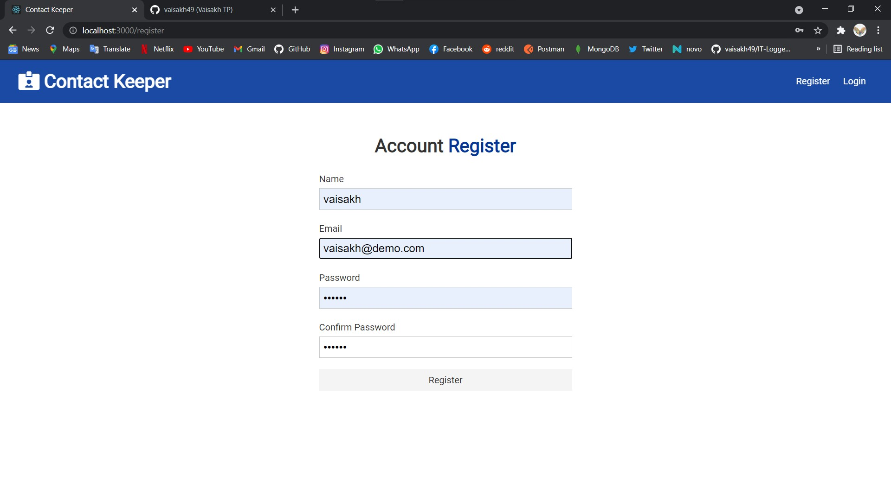
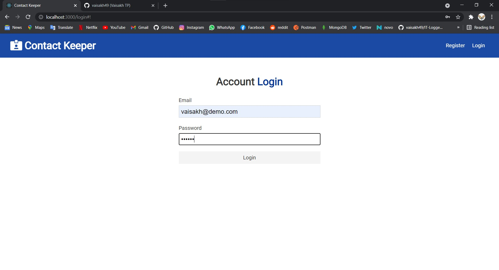
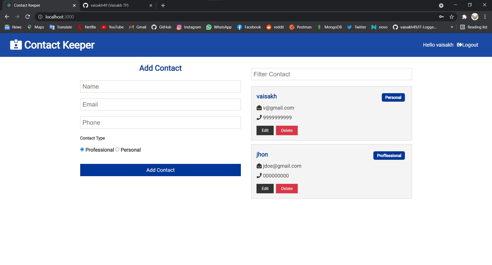
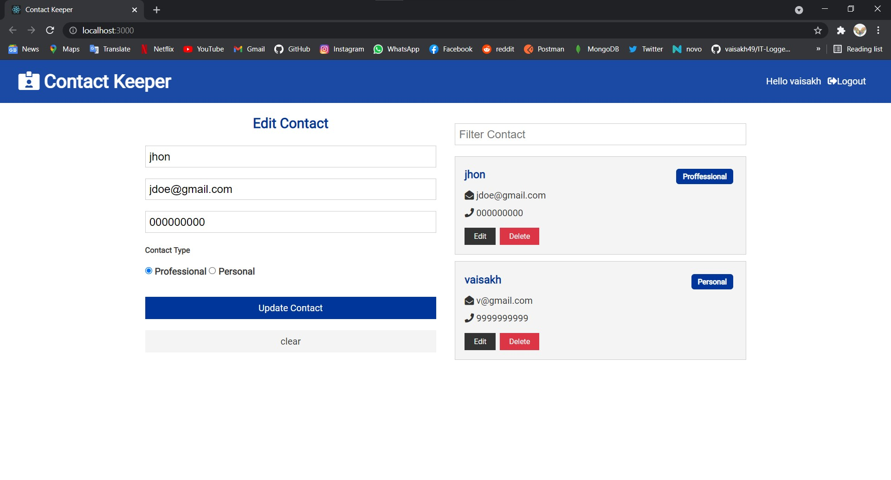
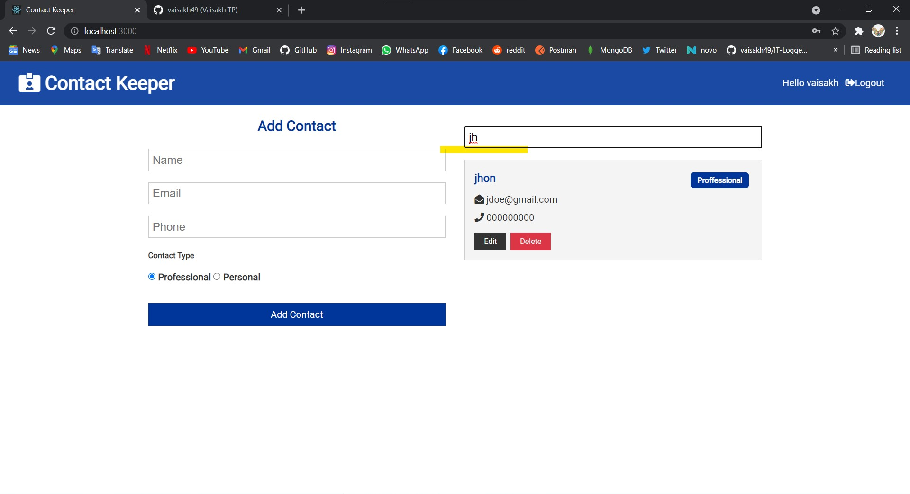

# Contact-Keeper
The purpose of this application is to allow you to store contacts. Each user can create their own account and store contacts. Authenticated using JWT. This is a CRUD application built with Mern Stack. Context use as State management

<a href='https://quiet-springs-64938.herokuapp.com'>Go to site</a>

<h2>Screenshots</H2>

<h3>Register</h3>
 
 <h3>Login</h3>
 
 <h3>Post Contact</h3>
 
 <h3>Edit Contact</h3>
 
 <h3>Search Contact</h3>
 
 

